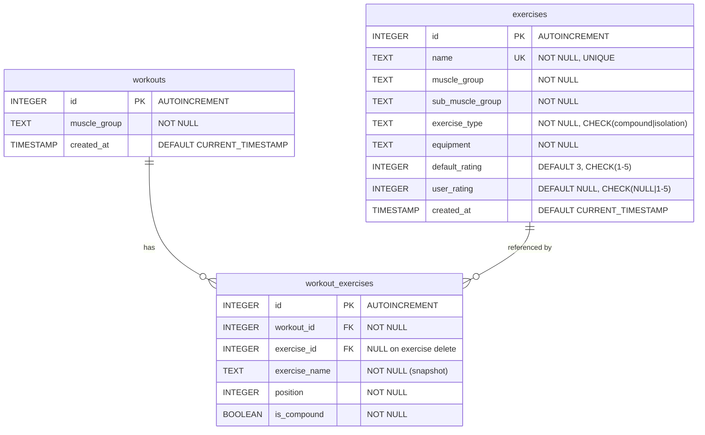

# WorkoutGen — Entity Relationship Diagram

## ERD (Mermaid)

## Relationships

| Relationship | Type | FK Constraint | Rationale |
|---|---|---|---|
| workouts → workout_exercises | One-to-Many | `ON DELETE CASCADE` | Deleting a workout removes all its exercise entries |
| exercises → workout_exercises | One-to-Many | `ON DELETE SET NULL` | Deleting an exercise preserves workout history (exercise_name snapshot retained) |

## Table Descriptions

### exercises
The master exercise catalog. Each exercise belongs to one muscle group and sub-muscle group, is either compound or isolation, and has a default rating (1-5). Users can optionally set a `user_rating` to influence workout generation weighting.

### workouts
A saved workout session. Records the muscle group and timestamp. Acts as a header table for the exercise list.

### workout_exercises
Junction table linking workouts to exercises. Stores the exercise position (order 1-5), type, and a `exercise_name` snapshot so that history remains readable even if the original exercise is deleted or renamed. The `exercise_id` FK is nullable (set to NULL when an exercise is deleted).

## Constraints Summary

- `exercises.name` — UNIQUE (prevents duplicate exercise names)
- `exercises.exercise_type` — CHECK IN ('compound', 'isolation')
- `exercises.default_rating` — CHECK BETWEEN 1 AND 5
- `exercises.user_rating` — CHECK NULL OR BETWEEN 1 AND 5
- `workout_exercises.workout_id` — NOT NULL, FK CASCADE
- `workout_exercises.exercise_id` — NULLABLE, FK SET NULL
